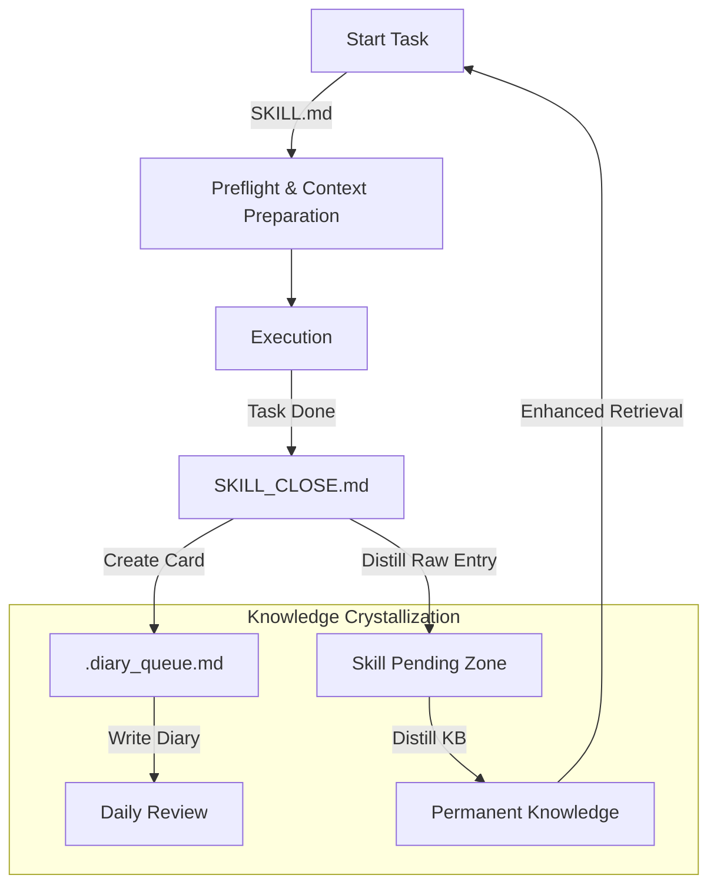
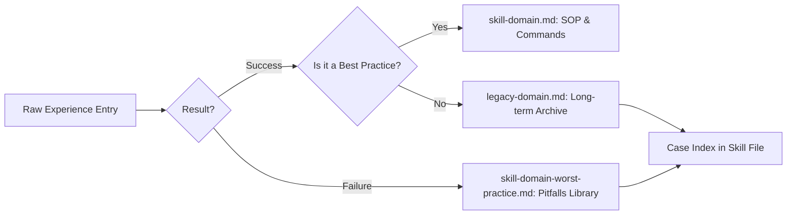

# Auto-Skill Core 🧠

[中文版本 (Chinese Version)](./README_zh.md)

**A cross-platform memory management system for all your agentic AIs.** Whether you use Claude, ChatGPT, or Gemini, your hard-earned technical experiences roam with you, ensuring you never lose your progress when switching models.

> **Transform your AI from a stateless tool into a self-evolving Second Brain.**

Auto-Skill is a framework designed to empower AI Coding Assistants (like Antigravity, Cursor, or Claude Code) with a recursive distillation loop. It ensures that every success, failure, and technical pitfall is captured, refined, and reused.

---

## 🔄 The Self-Evolution Loop

Auto-Skill operates on a continuous feedback loop. Every coding task becomes a source of new intelligence.



---

## 🦋 Experience Sifting (經驗分流)

The heart of the system is how it classifies and stores experiences. We don't just "save notes"; we sift them based on their utility.



### Where does it go?
1.  **Skill Files (`skill-*.md`)**: High-density SOPs, commands, and refined rules. This is what the AI reads *every time* it starts a task.
2.  **Legacy Files (`legacy-*.md`)**: Full logs of successful projects. Used as a reference when the AI needs to see "how we did it before."
3.  **Worst-Practice Files (`*-worst-practice.md`)**: A "minefield map." Records exactly why certain approaches failed to prevent re-trial.

---

## 📦 Project-Ledger Mode — for skills that outgrow one file

Every memory system has the same failure mode: the file the AI reads *every time* keeps growing,
until startup costs more than the task. Distilling helps, but a busy skill outruns distillation.

Project-ledger mode splits the two jobs that one file was doing:

| | Global `experience/skill-{id}.md` | Project `references/case-ledger.md` |
|---|---|---|
| Role | A **map** — entry point, where knowledge lives, source-of-truth order | The **history** — full cases, append-only |
| Read | Every task | Only when the task needs case history |
| Grows | No | Yes — and that's fine, nothing loads it by default |

**Graduate a skill when both are true:** it has its own project root (real code/data/repo, not just
a `.md`), and it produces cases continuously. Skills with no project of their own stay global —
centralizing them is the point.

Register it under `experienceRouting` in your config (see `auto-skill.config.example.json`), and
`SKILL_CLOSE` routes full cases to the project ledger automatically. Migration order matters:
**archive losslessly first** (verify SHA-256), then move cases, then rewrite the global file as a map.

> `SKILL_CLOSE` also *suggests* graduation on its own — when a ledger passes 5 pending entries and
> the skill meets both criteria, the summary card says so. It suggests; it never moves your files.

---

## ⚖️ Deferred Sync — a debrief should cost a file write

Archiving one entry used to trigger a full trigger-index rewrite, a vector rebuild, and a vault
mirror push. That's a fixed tax on every task, most of it wasted: the index rarely changes, and
a single new entry rarely needs to be searchable in the next 30 seconds.

v4.2 splits the debrief into lightweight and heavy paths. Heavy work is deferred until a ledger
hits **5 pending entries**, then runs once for everything accumulated. Candidate trigger words
queue up in `.trigger_queue.md` instead of reopening the index each time.

Nothing is at risk while deferred — entries are on disk immediately. Only *searchability* waits,
and the summary card shows the backlog (`🧵 <ledger> N/5 pending`) so it's never silent.

---

## 🧰 Integrated Module Guide

### 📔 1. Diary Skill (The Narrative Layer)
**Trigger**: `"Write Diary"`, `"Daily Review"`

The Diary skill aggregates all task cards generated during the day into a cohesive daily log.
- **Goal**: Keep your human-self and AI-self on the same page about progress.
- **Workflow**: Reads `.diary_queue.md` → Fuses with existing daily notes → Clears the queue.

### 🧪 2. Distill-KB Skill (The Crystallization Layer)
**Trigger**: `"Distill {domain}"`, `"Crystallize Knowledge"`

This is where the actual "learning" happens.
- **Goal**: Move raw notes from the "Pending Zone" into the "Refined Zone."
- **Workflow**: Scans skill files → Extracts SOPs → Routes cases to Legacy/Worst-Practice → Updates the Case Index.

---

## 🛠️ Quick Start

### 1. Installation
```bash
git clone https://github.com/Allen930311/auto-skill-core.git
```

### 2. Configuration
- Rename `auto-skill.config.example.json` to `auto-skill.config.json`.

> **Note — vault path (optional):** Setting a `vault` path is the original developer's personal habit for syncing experiences to an Obsidian vault. If you do not use such a setup, simply tell your AI: *"Remove the vault path step from SKILL.md — I do not need it."* The AI will trim the startup flow accordingly.

### 3. Global Shielding
Run the reinforcement script to bake the protocol into your IDE:
```bash
python scripts/global_reinforce.py
```

---

## 📜 Credits

This project is a refactored and generalized version of the original framework created by **[Toolsai/auto-skill](https://github.com/Toolsai/auto-skill)**. 

## ⚖️ License

MIT License.
