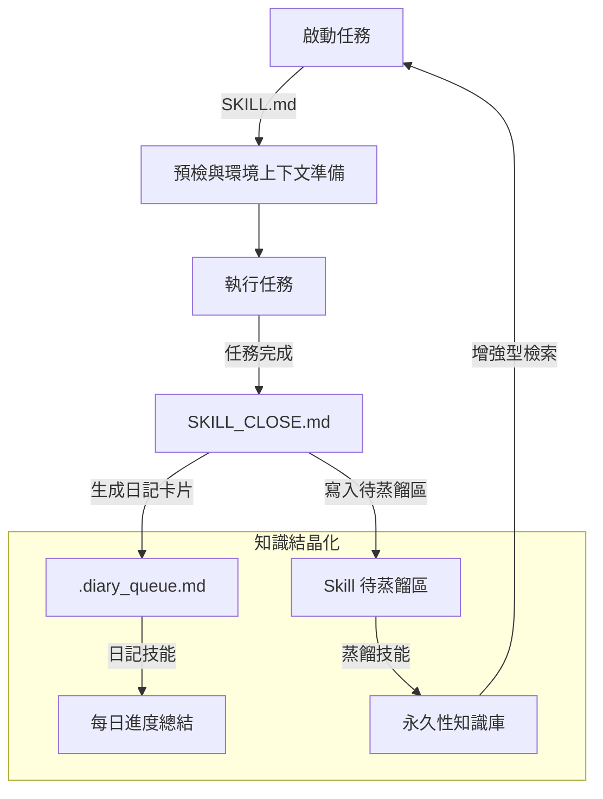
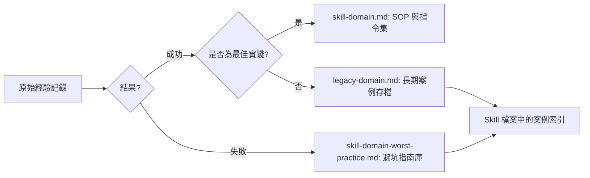

# Auto-Skill Core 🧠 | 自動化 AI 經驗進階框架

**這是一個讓您所有 AI 共同管理記憶的地方。** 無論您是使用 Claude、ChatGPT 還是 Gemini，甚至是未來「換家」跳槽，您的技術經驗與踩坑紀錄都會被妥善保存並隨時隨地同步，無需擔心進度遺失。

> **讓你的 AI 從單純的工具，進化為擁有「第二大腦」的自成長專家。**

Auto-Skill 是一個專為 AI 程式助手（如 Antigravity, Cursor 或 Claude Code）設計的遞迴式經驗蒸餾框架。它確保每一次的開發成功、失敗與技術細節都能被捕捉、提煉並重複利用。

---

## 🔄 自我進化循環 (The Self-Evolution Loop)

Auto-Skill 建立在持續反饋的循環之上。每一次程式任務都成為新智慧的來源。



---

## 🦋 經驗分流 (Experience Sifting)

系統的核心在於如何分類與儲存經驗。我們不只是「存筆記」，而是根據效用進行分流（Butterflying）。



### 知識去哪了？
1.  **技能檔案 (`skill-*.md`)**：高密度的 SOP、複用指令與精煉規則。這是 AI 每次啟動任務時**必讀**的內容。
2.  **成功案例庫 (`legacy-*.md`)**：完整記錄過去成功的專案細節。當 AI 需要回溯「以前是怎麼做的」時作為參考。
3.  **失敗案例庫 (`*-worst-practice.md`)**：一份「雷區地圖」。精確記錄為何某種方法行不通，防止 AI 重複錯誤。

---

## 🧰 內建技能模組

### 📔 1. 日記技能 (Diary Skill)
**觸發詞**：`"寫日記"`、`"Daily Review"`

將一天中產生的所有任務卡片，聚合為一份具備時間線與專案分類的每日日誌。
- **目標**：確保人類與 AI 對目前進度與待辦事項保持同步。
- **流程**：讀取隊列 → 融合現有日誌 → 清空隊列。

### 🧪 2. 蒸餾技能 (Distill-KB Skill)
**觸發詞**：`"進行蒸餾"`、`"整理經驗"`

這是系統實現「學習」的關鍵步驟。
- **目標**：將「原始筆記」轉化為「精煉知識」。
- **流程**：掃描 Pending Zone → 提取精華 → 路由至案例庫 → 更新主要 Skill 文件索引。

---

## 🛠️ 快速上手

### 1. 安裝
```bash
git clone https://github.com/Allen930311/auto-skill-core.git
```

### 2. 配置
- 將 `auto-skill.config.example.json` 重新命名為 `auto-skill.config.json`。
- 設定您的 `vault` 路徑（經驗與知識庫存放的位置）。

### 3. 全局加固 (Global Shielding)
執行加固腳本，將自動啟動協議注入您的 IDE 全局規則中：
```bash
python scripts/global_reinforce.py
```

---

## 📜 鳴謝 (Credits)

本專案是基於 **[Toolsai/auto-skill](https://github.com/Toolsai/auto-skill)** 原創框架的重構與通用化版本。特別感謝原作者提出的「經驗蒸餾循環」概念。

## ⚖️ 授權 (License)

MIT License.
